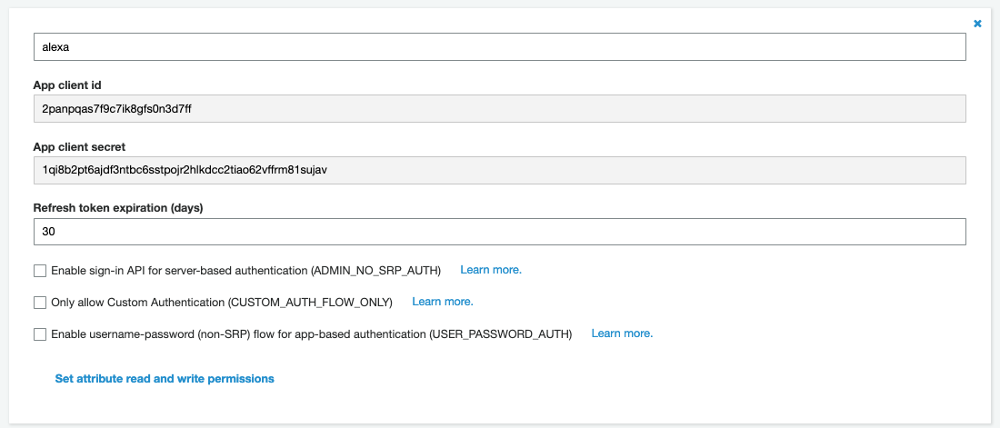
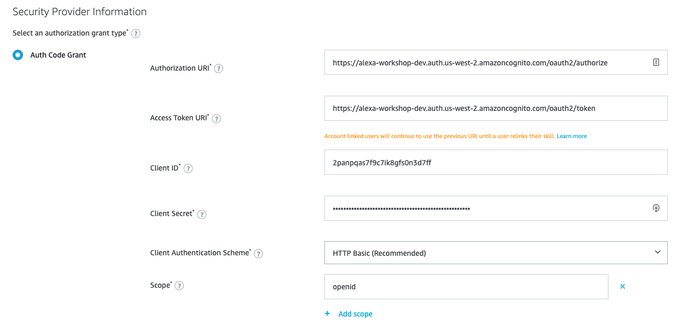

# Alexa Account Linking using Amazon Cognito User Pool

> TODO: add English brief description about what is Account Linking. Can copy from Alexa account linking doc.

完成该实验需要可以一个已经注册好的 Alexa Skill, 并且能够在 Alexa App 或者 Alex Web Portal 中显示该 Alexa Skill。

本文将介绍如何利用AWS Cognito User Pool 实现 Alexa 的账户关联。这里将不涉及到 Cognito 或者 Alexa 相关的开发。有关 Cognito User Pool 的更多资料请参考
[官方文档](https://docs.aws.amazon.com/cognito/latest/developerguide/cognito-user-identity-pools.html)。
有关Alexa的开发资料请参考 [Alexa Developer Portal](https://developer.amazon.com/alexa)。

## 什么是账户关联
账户关联(Account Linking)允许将用户在Alexa账号系统中的身份与另外一个账号系统中的身份关联起来。
假设这样的一个问题，系统X中存在用户a和用户b, Alexa 账户体系中存在用户A和用户B, 那么系统X收到来自
Alexa的指令后，如何区分这是来自用户a的请求还是用户b的呢？账户关联就是为了解决这个问题，将Alexa的账户
系统与另一个账号系统中的身份关联起来。

Alexa账户关联是标准的 OAuth2.0 授权, 本文不深入探讨 OAuth2.0, 有关 OAuth2.0 的理解可以参考
[理解OAuth 2.0](http://www.ruanyifeng.com/blog/2014/05/oauth_2_0.html)。

AWS的 [Cognito User Pool](https://docs.aws.amazon.com/zh_cn/cognito/latest/developerguide/cognito-user-identity-pools.html)提
供了标准的 OAuth 2.0 的认证和授权，因此借助 Cognito User Pool 可以快速实现和 Alexa 的账户关联。

下面这张流程图展示了一个用户在 Alexa APP 中进行账户关联，Alexa 是如何从授权服务器获得 AccessToken 的整个过程。

在完成 Alexa 的账户关联之后，用户与 Skill 交互产生的指令会被发送到 Resource Server, 该指令中包含用户的 AccessToken。
这里的 Resource Server 就是 Alexa Kill 控制中配置的 [**Endpoint**](https://developer.amazon.com/zh/docs/custom-skills/host-a-custom-skill-as-a-web-service.html)。

在 Resource Server 上，通过 Decode AccessToken, 能够获得用户名。

## Configure App Client OAuth 2.0 Settings

Account linking in the Alexa Skills Kit uses [OAuth 2.0](https://tools.ietf.org/html/rfc6749). 
By default, OAuth 2.0 for App Client in Cognito User Pool is not enabled. Follow the following
step to enable Auth2.0.

1. Go to Cognito User Pool Console

1. On the left side navigation bar, under App integration, select **App client settings**

1. Find the App Client created in [Create a Cognito User Pool Client](#create-a-cognito-user-pool-client), if you
followed the guide, it should be named `alexa`

1. Under **Enabled Identity Providers**，select **Cognito User Pool**

1. In **Callback URL(s)**，enter **Redirect URLs** copied from Alexa Developer Console. In Alexa Developer Console,
choose **Account Linking**, scroll down to the bottom, you should be able to find three **Redirect URL**. Alexa redirect 
to different url based on user's region. To serve all the Alexa users, it is suggested to copy all the URLs.

1. In **Allowed OAuth Flows** session，choose **Authorization code grant**

1. In **Allowed OAuth Scopes** session，choose **openid**

1. Click **Save changes**

## Configure Cognito User Pool domain name

The default domain name of Cognito follows the pattern `https://<domain-prefix>.auth.<region>.amazoncognito.com`。
You can use your own domain，to get more information please refer to 
[Adding a Custom Domain to a User Pool](https://docs.aws.amazon.com/cognito/latest/developerguide/cognito-user-pools-add-custom-domain.html#cognito-user-pools-add-custom-domain-adding)。
In this lab, we will use the default domain name.

1. Go to Cognito User Pool Console

1. On the left side bar, under **App integration**, choose **Domain name**

1. Enter domain prefix and click **Check availability**, the domain name must be unique

1. When promoted **the domain is available**，choose **Save changes**

## Configure Account Linking in Alexa Developer Console

1. Go to [Alexa Console](https://developer.amazon.com/alexa/console/ask)

1. In the **Skills** list，choose the previously created skill

1. On the left side navigation bar，choose **Account Linking**

1. Under **Security Provider Information**，choose **Auth Code Grant**

1. Enter `https://<your-cognito-domain>/oauth2/authorize` in **Authorization URI**

1. Enter `https://<your-cognito-domain>/oauth2/token` in **Access Token URI**

1. Enter **Client ID** and **Client Secret**, you can find in them in Cognito User Pool console, under **App Clients** section

1. Click **Add scope** and input `openid`. For Smart Home skill, at least one scope should be specified

1. Click **Save** on the top right corner

For more about Cognito OAuth2.0 URI, please refer to 
[Amazon Cognito User Pools Auth API Reference](https://docs.aws.amazon.com/cognito/latest/developerguide/cognito-userpools-server-contract-reference.html)

## Enable Account Linking in Alexa App

> Only the Developer Account can see the Skill in development. You must use the same account as creating
> the skill. You may also need a VPN to use the Alexa APP if you are in China.

1. Launch Alexa APP on mobile phone, or using [Alexa Web Portal](https://alexa.amazon.com/spa/index.html). 
You probably may not be able to see the skills in Web Portal, so it it recommended to use Alexa APP 

1. Click the button on the top left corner

1. Choose **Skills & Games** 

1. On **Skills & Games** page，click the **Enabled** dropdown list and choose **DEV**, you should be able
the created Smart Home Skill

1. Click the **Enable To Use** button, 

1. On the popup window, input your **email** and **password**, if have not registered yet, sign up one

1. Account Link success

So far, the account linking between Alexa and Cognito User Pool has been configured successfully. In 
the following directives sending from Alexa, it will contain **accessToken** in the message body. 
The **accessToken** follows the JWT spec. In the backend Lambda, you can verify and decode the JWT token
to get the user identity.

## Reference
[Understand Account Linking](https://developer.amazon.com/docs/account-linking/understand-account-linking.html)

[The OAuth2.0 Authorization Framework](https://tools.ietf.org/html/rfc6749)

[JSON Web Token](https://en.wikipedia.org/wiki/JSON_Web_Token)

[AWS Cognito User Pool](https://docs.aws.amazon.com/zh_cn/cognito/latest/developerguide/cognito-user-identity-pools.html)
